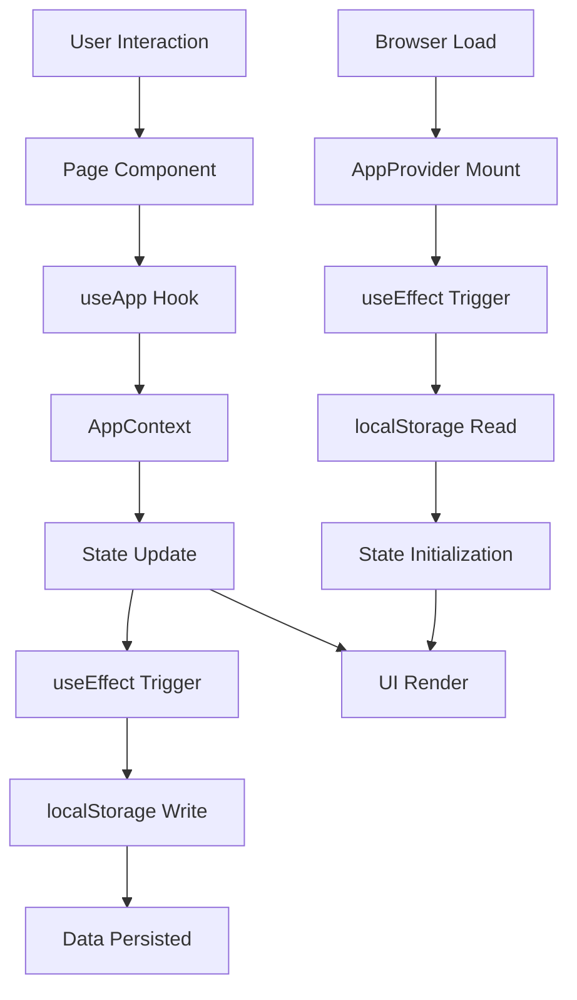
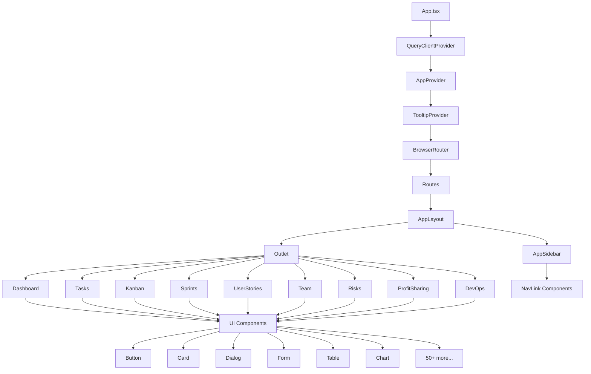
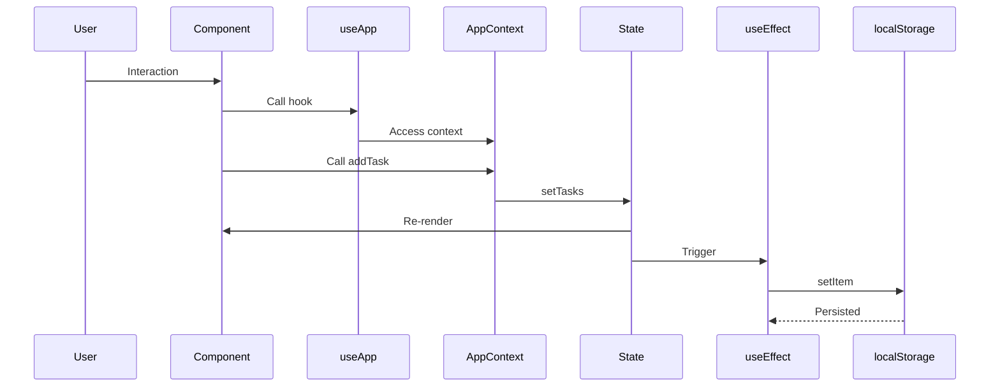
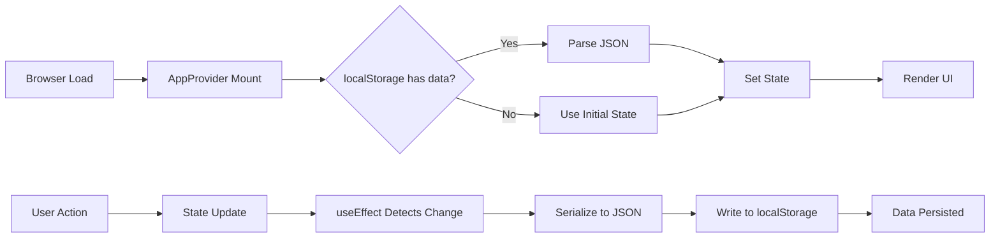
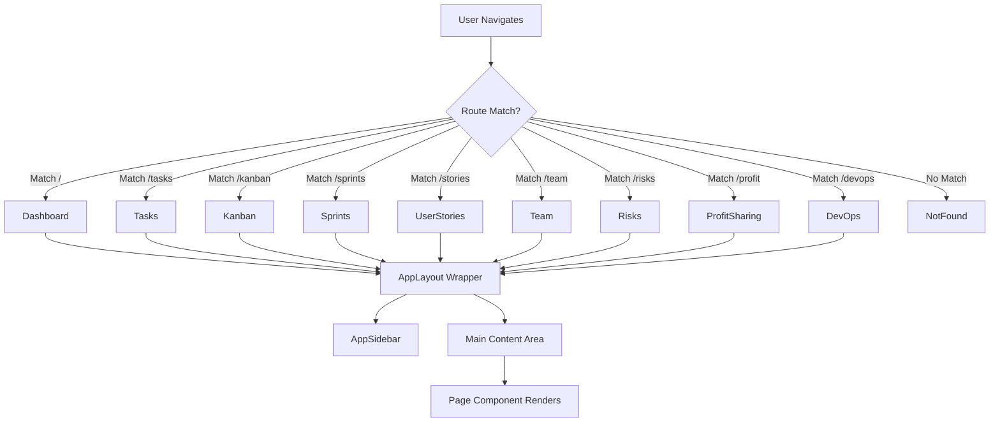

# System Architecture Documentation

## Overview

Backlog Pro - Agile Suite is a modern, client-side web application built with React 18.3 and TypeScript 5.8. The application provides a comprehensive Agile project management platform with features including task management, Kanban boards, sprint planning, team management, risk assessment, and DevOps metrics tracking.

### Technology Stack

- **Build Tool**: Vite 5.4 with SWC for fast compilation
- **Framework**: React 18.3 with TypeScript 5.8
- **Styling**: Tailwind CSS 3.4 with custom design tokens
- **UI Components**: shadcn/ui (built on Radix UI primitives)
- **State Management**: React Context API with localStorage persistence
- **Routing**: React Router v6
- **Data Persistence**: Browser localStorage (client-side only)
- **Charts**: Recharts for data visualization
- **Drag & Drop**: @dnd-kit and @hello-pangea/dnd for Kanban functionality
- **Forms**: react-hook-form with Zod validation
- **Icons**: lucide-react
- **Notifications**: Sonner for toast notifications

### Design Philosophy

The application follows a modern glassmorphic design with:
- Deep indigo primary color (#5B63F5)
- Teal accent color (#14B8A6)
- Semantic color tokens for success, warning, and destructive states
- Smooth transitions and hover effects
- Mobile-first responsive approach
- HSL-based color system for consistent theming

## Component Architecture

### Application Structure

```
App (Root)
├── QueryClientProvider (React Query)
├── AppProvider (Global State)
├── TooltipProvider
├── Toaster (Toast notifications)
├── Sonner (Alternative toast system)
└── BrowserRouter
    └── Routes
        └── AppLayout (Layout wrapper)
            ├── AppSidebar (Navigation)
            └── Page Components (via Outlet)
```

### Component Hierarchy

#### 1. Root Level (`App.tsx`)

The root component establishes the provider hierarchy:

1. **QueryClientProvider**: Wraps the app for React Query support (configured but not actively used)
2. **AppProvider**: Provides global state management via Context API
3. **TooltipProvider**: Enables tooltip functionality across the app
4. **Toaster & Sonner**: Dual toast notification systems
5. **BrowserRouter**: Enables client-side routing

#### 2. Layout Components

**AppLayout** (`src/components/layout/AppLayout.tsx`)
- Wraps all page routes using React Router's `<Outlet />`
- Provides consistent layout structure with sidebar and main content area
- Uses SidebarProvider for responsive sidebar behavior
- Applies gradient background: `from-background via-background to-primary/5`

**AppSidebar** (`src/components/layout/AppSidebar.tsx`)
- Fixed navigation sidebar with brand header
- Contains 9 navigation items with icons and labels
- Uses custom NavLink component for active state styling
- Responsive: collapses on mobile devices

#### 3. Page Components

Each route maps to a dedicated page component in `src/pages/`:

| Route | Component | Purpose |
|-------|-----------|---------|
| `/` | Dashboard.tsx | KPI metrics and overview charts |
| `/tasks` | Tasks.tsx | Task management with CRUD operations |
| `/kanban` | Kanban.tsx | Drag-and-drop Kanban board |
| `/sprints` | Sprints.tsx | Sprint planning and tracking |
| `/stories` | UserStories.tsx | User story management with INVEST format |
| `/team` | Team.tsx | Team member profiles and individual KPIs |
| `/risks` | Risks.tsx | 5x5 risk matrix management |
| `/profit` | ProfitSharing.tsx | Revenue distribution calculations |
| `/devops` | DevOps.tsx | DORA metrics dashboard |
| `*` (catch-all) | NotFound.tsx | 404 error page |

#### 4. UI Components

The application uses 50+ reusable UI primitives from shadcn/ui located in `src/components/ui/`:

**Core Components**:
- **Forms**: Input, Textarea, Select, Checkbox, Radio Group, Switch
- **Feedback**: Alert, Alert Dialog, Toast, Sonner
- **Navigation**: Tabs, Breadcrumb, Navigation Menu, Menubar
- **Layout**: Card, Separator, Scroll Area, Resizable Panels, Sidebar
- **Overlays**: Dialog, Drawer, Popover, Hover Card, Tooltip, Context Menu, Dropdown Menu
- **Data Display**: Table, Badge, Avatar, Accordion, Collapsible
- **Input**: Button, Calendar, Slider, Progress, Input OTP
- **Charts**: Chart components with Recharts integration

All UI components follow Radix UI patterns with Tailwind CSS styling and support for theming via CSS variables.

### Custom Components

**NavLink** (`src/components/NavLink.tsx`)
- Custom navigation link component
- Extends React Router's NavLink with active state styling
- Accepts `activeClassName` prop for custom active styles

## State Management

### Context API Implementation

The application uses a centralized Context API pattern for global state management, implemented in `src/context/AppContext.tsx`.

#### AppContext Structure

```typescript
interface AppContextType {
  // State
  tasks: Task[];
  userStories: UserStory[];
  sprints: Sprint[];
  teamMembers: TeamMember[];
  risks: Risk[];
  profitShares: ProfitShare[];
  kpiMetrics: KPIMetrics;
  
  // CRUD Operations
  addTask: (task: Task) => void;
  updateTask: (id: string, task: Partial<Task>) => void;
  deleteTask: (id: string) => void;
  addUserStory: (story: UserStory) => void;
  updateUserStory: (id: string, story: Partial<UserStory>) => void;
  deleteUserStory: (id: string) => void;
  addSprint: (sprint: Sprint) => void;
  updateSprint: (id: string, sprint: Partial<Sprint>) => void;
  deleteSprint: (id: string) => void;
  updateTeamMember: (id: string, member: Partial<TeamMember>) => void;
  addRisk: (risk: Risk) => void;
  updateRisk: (id: string, risk: Partial<Risk>) => void;
  deleteRisk: (id: string) => void;
  updateProfitShares: (shares: ProfitShare[]) => void;
  updateKPIMetrics: (metrics: Partial<KPIMetrics>) => void;
}
```

#### State Initialization

1. **Initial Load**: Sample data is initialized via `initializeSampleData()` on first mount
2. **Team Members**: Hard-coded initial team (Pedro, David, Morena, Franco) with default KPIs
3. **KPI Metrics**: Default metrics initialized with baseline values
4. **Other Entities**: Loaded from localStorage if available

#### localStorage Synchronization Strategy

The application implements automatic bidirectional sync between React state and localStorage:

**Loading from localStorage**:
- On component mount, `useEffect` hooks check for existing data in localStorage
- If data exists, it's parsed and loaded into React state
- Keys used: `tasks`, `userStories`, `sprints`, `risks`, `profitShares`, `kpiMetrics`

**Saving to localStorage**:
- Separate `useEffect` hooks watch each state array/object
- When state changes, data is automatically serialized to localStorage
- Ensures data persistence across browser sessions

**Data Flow**:
```
User Action → Context Method → State Update → useEffect Trigger → localStorage Write
Browser Load → useEffect Trigger → localStorage Read → State Update → UI Render
```

### State Access Pattern

Components access global state using the `useApp()` hook:

```typescript
const { tasks, addTask, updateTask, deleteTask } = useApp();
```

This pattern:
- Ensures type safety with TypeScript
- Throws error if used outside AppProvider
- Provides clean, predictable API for state operations

## Data Flow

### Complete Data Flow Diagram



### Data Flow Layers

#### 1. Presentation Layer (UI Components)
- React components render UI based on state
- User interactions trigger events (clicks, form submissions, drag-and-drop)
- Components are purely presentational where possible

#### 2. State Management Layer (Context API)
- AppContext holds all application state
- Provides CRUD methods for each entity type
- Manages state updates immutably using React hooks

#### 3. Persistence Layer (localStorage)
- Automatic synchronization via useEffect hooks
- JSON serialization/deserialization
- No manual save/load operations required
- Data persists across browser sessions

### CRUD Operation Flow

Example: Adding a new task

```
1. User fills form in Tasks page
2. Form submission calls addTask() from useApp()
3. addTask() updates tasks state: setTasks([...tasks, newTask])
4. React re-renders components using tasks
5. useEffect detects tasks change
6. localStorage.setItem('tasks', JSON.stringify(tasks))
7. Data persisted to browser storage
```

### Entity Relationships

Entities reference each other through ID fields:

- **Task** → Sprint (via `sprintId`)
- **Task** → UserStory (via `storyId`)
- **Task** → TeamMember (via `assignedTo`)
- **UserStory** → Sprint (via `sprintId`)
- **Risk** → TeamMember (via `owner`)
- **ProfitShare** → TeamMember (via `memberId`)

These relationships are maintained at the application level (no database constraints).

## Routing Architecture

### React Router v6 Configuration

The application uses React Router v6 with a nested route structure defined in `App.tsx`.

#### Route Structure

```typescript
<Routes>
  <Route element={<AppLayout />}>
    <Route path="/" element={<Dashboard />} />
    <Route path="/tasks" element={<Tasks />} />
    <Route path="/kanban" element={<Kanban />} />
    <Route path="/sprints" element={<Sprints />} />
    <Route path="/stories" element={<UserStories />} />
    <Route path="/team" element={<Team />} />
    <Route path="/risks" element={<Risks />} />
    <Route path="/profit" element={<ProfitSharing />} />
    <Route path="/devops" element={<DevOps />} />
  </Route>
  <Route path="*" element={<NotFound />} />
</Routes>
```

#### Route Mapping

| Path | Component | Description |
|------|-----------|-------------|
| `/` | Dashboard | Home page with KPI overview and charts |
| `/tasks` | Tasks | Task management interface with filtering and CRUD |
| `/kanban` | Kanban | Drag-and-drop Kanban board with status columns |
| `/sprints` | Sprints | Sprint planning, tracking, and burn-down charts |
| `/stories` | UserStories | User story management with INVEST format |
| `/team` | Team | Team member profiles with individual KPIs |
| `/risks` | Risks | 5x5 risk matrix with mitigation tracking |
| `/profit` | ProfitSharing | Revenue distribution calculator |
| `/devops` | DevOps | DORA metrics dashboard |
| `*` | NotFound | 404 error page for undefined routes |

#### Layout Route Pattern

All main routes are nested under `<AppLayout />`, which:
- Provides consistent sidebar navigation
- Renders child routes via `<Outlet />`
- Applies global layout styling
- Ensures responsive behavior

The catch-all `*` route is placed outside the layout to provide a standalone 404 page.

#### Navigation Implementation

Navigation is handled through:
1. **AppSidebar**: Contains NavLink components for each route
2. **NavLink**: Custom component wrapping React Router's NavLink
3. **Active State**: Automatically applies `activeClassName` to current route
4. **Programmatic Navigation**: Components can use `useNavigate()` hook when needed

## Build System and Vite Configuration

### Vite Configuration

The application uses Vite 5.4 as its build tool, configured in `vite.config.ts`.

#### Key Configuration Options

```typescript
{
  server: {
    host: "::",      // Listen on all network interfaces
    port: 8080,      // Development server port
  },
  plugins: [
    react(),                              // SWC-based React plugin
    mode === "development" && componentTagger()  // Lovable tagger in dev mode
  ],
  resolve: {
    alias: {
      "@": path.resolve(__dirname, "./src"),  // Path alias for imports
    },
  },
}
```

#### Development Server

- **Host**: `::` (IPv6 all interfaces) - allows access from network devices
- **Port**: 8080
- **Hot Module Replacement (HMR)**: Enabled via @vitejs/plugin-react-swc
- **Fast Refresh**: React components update without losing state

#### Build Modes

**Development Build** (`npm run build:dev`):
- Includes component tagger for debugging
- Source maps enabled
- Less aggressive optimization

**Production Build** (`npm run build`):
- Minified and optimized output
- Tree-shaking removes unused code
- Assets hashed for cache busting
- Output to `dist/` directory

#### Path Alias

The `@` alias maps to `./src/`, enabling clean imports:

```typescript
// Instead of: import { Button } from '../../components/ui/button'
import { Button } from '@/components/ui/button'
```

### TypeScript Configuration

The project uses TypeScript 5.8 with three configuration files:

#### tsconfig.json (Base)
- Extends `tsconfig.app.json`
- References `tsconfig.node.json` for build tools

#### tsconfig.app.json (Application)
- **Target**: ES2020
- **Module**: ESNext
- **JSX**: react-jsx
- **Strict Mode**: Partially enabled
  - `noImplicitAny: false` - Allows implicit any types
  - `strictNullChecks: false` - Allows null/undefined without explicit checks
- **Path Mapping**: `@/*` → `./src/*`
- **Skip Lib Check**: Enabled for faster builds

#### tsconfig.node.json (Build Tools)
- Configuration for Vite and other Node.js tools
- Separate from application code

### Dependency Management

#### Core Dependencies

**React Ecosystem**:
- react, react-dom (18.3.1)
- react-router-dom (6.30.1)
- @tanstack/react-query (5.83.0)

**UI & Styling**:
- tailwindcss (3.4.17)
- @radix-ui/* (50+ UI primitive packages)
- lucide-react (0.462.0) - Icons
- class-variance-authority, clsx, tailwind-merge - Styling utilities

**Forms & Validation**:
- react-hook-form (7.61.1)
- zod (3.25.76)
- @hookform/resolvers (3.10.0)

**Data Visualization**:
- recharts (2.15.4)

**Drag & Drop**:
- @dnd-kit/* (6.3.1, 10.0.0, 3.2.2)
- @hello-pangea/dnd (18.0.1)

**Utilities**:
- date-fns (3.6.0)
- sonner (1.7.4) - Toast notifications

#### Development Dependencies

- **Vite**: 5.4.19
- **TypeScript**: 5.8.3
- **ESLint**: 9.32.0 with React plugins
- **Tailwind CSS**: 3.4.17 with plugins
- **lovable-tagger**: 1.1.11 (development component tracking)

### Build Scripts

The application provides several npm scripts for development and production workflows:

#### Development Scripts

**`npm run dev`**
- Starts the Vite development server on port 8080
- Enables hot module replacement (HMR) for instant updates
- Runs on all network interfaces (`::`), allowing access from other devices
- Command: `vite`

**`npm run lint`**
- Runs ESLint to check code quality and style
- Uses ESLint 9.32.0 with React-specific rules
- Helps maintain code consistency across the project
- Command: `eslint .`

#### Build Scripts

**`npm run build`**
- Creates optimized production build
- Minifies code and assets
- Outputs to `dist/` directory
- Command: `tsc -b && vite build`

**`npm run build:dev`**
- Creates development build with extra tooling
- Includes component tagger for debugging
- Less aggressive optimization than production
- Command: `tsc -b && vite build --mode development`

**`npm run preview`**
- Previews the production build locally
- Serves the `dist/` directory
- Useful for testing production build before deployment
- Command: `vite preview`

#### Testing Scripts

**`npm run test`**
- Runs all tests once and exits
- Uses Vitest test runner
- Suitable for CI/CD pipelines
- Command: `vitest --run`

**`npm run test:watch`**
- Runs tests in watch mode
- Automatically re-runs tests when files change
- Useful during development
- Command: `vitest`

**`npm run test:docs`**
- Runs documentation validation tests
- Uses separate Vitest configuration for documentation tests
- Validates documentation completeness and correctness
- Command: `vitest --run --config vitest.config.docs.ts`

#### Quick Reference

```bash
npm run dev        # Start development server on port 8080
npm run build      # Production build
npm run build:dev  # Development build with extra tooling
npm run lint       # Run ESLint
npm run preview    # Preview production build locally
npm run test       # Run all tests once
npm run test:watch # Run tests in watch mode
npm run test:docs  # Run documentation validation tests
```

## Architecture Diagrams

### Component Relationship Diagram



### State Management Flow Diagram




### Data Persistence Flow Diagram



### Routing Flow Diagram



## Key Design Patterns

### 1. Provider Pattern
- Multiple providers wrap the application (Query, Context, Tooltip)
- Enables dependency injection and global state access
- Follows React best practices for context usage

### 2. Compound Component Pattern
- UI components like Sidebar, Card, Dialog use compound components
- Parent component provides context to children
- Example: `<Card><CardHeader /><CardContent /></Card>`

### 3. Custom Hook Pattern
- `useApp()` encapsulates context access logic
- `useMobile()` provides responsive breakpoint detection
- `useToast()` manages toast notifications
- Promotes reusability and separation of concerns

### 4. Layout Route Pattern
- Nested routes share common layout via `<Outlet />`
- Reduces code duplication
- Ensures consistent UI structure

### 5. Immutable State Updates
- All state updates use spread operators or array methods
- Never mutate state directly
- Ensures React can detect changes and re-render

### 6. Separation of Concerns
- **Pages**: Route-level components, orchestrate features
- **Components**: Reusable UI primitives
- **Context**: Global state management
- **Types**: Centralized type definitions
- **Utils**: Helper functions and constants

## Performance Considerations

### Optimization Strategies

1. **Vite + SWC**: Fast build times and hot module replacement
2. **Code Splitting**: React Router automatically splits routes
3. **Memoization**: Can be added to expensive computations if needed
4. **localStorage**: Efficient client-side persistence without network calls
5. **Tailwind CSS**: Purges unused styles in production builds

### Potential Bottlenecks

1. **localStorage Size Limits**: Browser limit ~5-10MB
2. **Large Lists**: Consider virtualization for 1000+ items
3. **Drag & Drop**: Can be CPU-intensive with many items
4. **Chart Rendering**: Recharts can be slow with large datasets

## Security Considerations

### Current Implementation

- **Client-Side Only**: No backend authentication
- **localStorage**: Data stored in plain text in browser
- **No Encryption**: Sensitive data not encrypted
- **No Access Control**: All data accessible to anyone with browser access

### Recommendations for Production

1. Implement backend API with authentication
2. Use JWT tokens or session-based auth
3. Encrypt sensitive data before localStorage storage
4. Add role-based access control (RBAC)
5. Implement HTTPS in production
6. Add CSRF protection if using cookies
7. Sanitize user inputs to prevent XSS

## Future Enhancements

### Potential Improvements

1. **Backend Integration**: Connect to Supabase or custom API
2. **Real-Time Collaboration**: WebSocket support for multi-user editing
3. **Offline Support**: Service worker for PWA capabilities
4. **Data Export**: CSV/JSON export functionality
5. **Advanced Filtering**: Complex query builder for tasks/stories
6. **Notifications**: Browser notifications for deadlines
7. **Dark Mode**: Theme switcher (infrastructure exists via next-themes)
8. **Internationalization**: Multi-language support with i18n
9. **Testing**: Unit tests, integration tests, E2E tests
10. **Analytics**: Track user behavior and feature usage

## Related Documentation

- [API Reference](../api/api-reference.md) - Complete data model and CRUD operation documentation
- [Admin Guide](../user-guides/admin-guide.md) - Configuration and maintenance procedures
- [End User Guide](../user-guides/end-user-guide.md) - Feature usage instructions

## Changelog

- 2025-11-19: Initial system architecture documentation created


### Vite Configuration

The application uses Vite 5.4 as its build tool, configured in `vite.config.ts`.

#### Key Configuration Options

```typescript
{
  server: {
    host: "::",      // Listen on all network interfaces
    port: 8080,      // Development server port
  },
  plugins: [
    react(),                              // SWC-based React plugin
    mode === "development" && componentTagger()  // Lovable tagger in dev mode
  ],
  resolve: {
    alias: {
      "@": path.resolve(__dirname, "./src"),  // Path alias for imports
    },
  },
}
```

#### Development Server

- **Host**: `::` (IPv6 all interfaces) - allows access from network devices
- **Port**: 8080
- **Hot Module Replacement (HMR)**: Enabled via @vitejs/plugin-react-swc
- **Fast Refresh**: React components update without losing state

#### Build Modes

**Development Build** (`npm run build:dev`):
- Includes component tagger for debugging
- Source maps enabled
- Less aggressive optimization

**Production Build** (`npm run build`):
- Minified and optimized output
- Tree-shaking removes unused code
- Assets hashed for cache busting
- Output to `dist/` directory

#### Path Alias

The `@` alias maps to `./src/`, enabling clean imports:

```typescript
// Instead of: import { Button } from '../../components/ui/button'
import { Button } from '@/components/ui/button'
```

### TypeScript Configuration

The project uses TypeScript 5.8 with three configuration files:

#### tsconfig.json (Base)
- Extends `tsconfig.app.json`
- References `tsconfig.node.json` for build tools

#### tsconfig.app.json (Application)
- **Target**: ES2020
- **Module**: ESNext
- **JSX**: react-jsx
- **Strict Mode**: Partially enabled
  - `noImplicitAny: false` - Allows implicit any types
  - `strictNullChecks: false` - Allows null/undefined without explicit checks
- **Path Mapping**: `@/*` → `./src/*`
- **Skip Lib Check**: Enabled for faster builds

#### tsconfig.node.json (Build Tools)
- Configuration for Vite and other Node.js tools
- Separate from application code

### Core Dependencies

**React Ecosystem**:
- react, react-dom (18.3.1)
- react-router-dom (6.30.1)
- @tanstack/react-query (5.83.0)

**UI & Styling**:
- tailwindcss (3.4.17)
- @radix-ui/* (50+ UI primitive packages)
- lucide-react (0.462.0) - Icons
- class-variance-authority, clsx, tailwind-merge - Styling utilities

**Forms & Validation**:
- react-hook-form (7.61.1)
- zod (3.25.76)
- @hookform/resolvers (3.10.0)

**Data Visualization**:
- recharts (2.15.4)

**Drag & Drop**:
- @dnd-kit/* (6.3.1, 10.0.0, 3.2.2)
- @hello-pangea/dnd (18.0.1)

**Utilities**:
- date-fns (3.6.0)
- sonner (1.7.4) - Toast notifications

### Development Dependencies

- **Vite**: 5.4.19
- **TypeScript**: 5.8.3
- **ESLint**: 9.32.0 with React plugins
- **Tailwind CSS**: 3.4.17 with plugins
- **lovable-tagger**: 1.1.11 (development component tracking)

### Build Scripts

The application provides several npm scripts for development and production workflows:

#### Development Scripts

**`npm run dev`**
- Starts the Vite development server on port 8080
- Enables hot module replacement (HMR) for instant updates
- Runs on all network interfaces (`::`), allowing access from other devices
- Command: `vite`

**`npm run lint`**
- Runs ESLint to check code quality and style
- Uses ESLint 9.32.0 with React-specific rules
- Helps maintain code consistency across the project
- Command: `eslint .`

#### Build Scripts

**`npm run build`**
- Creates optimized production build
- Minifies code and assets
- Outputs to `dist/` directory
- Command: `tsc -b && vite build`

**`npm run build:dev`**
- Creates development build with extra tooling
- Includes component tagger for debugging
- Less aggressive optimization than production
- Command: `tsc -b && vite build --mode development`

**`npm run preview`**
- Previews the production build locally
- Serves the `dist/` directory
- Useful for testing production build before deployment
- Command: `vite preview`

#### Testing Scripts

**`npm run test`**
- Runs all tests once and exits
- Uses Vitest test runner
- Suitable for CI/CD pipelines
- Command: `vitest --run`

**`npm run test:watch`**
- Runs tests in watch mode
- Automatically re-runs tests when files change
- Useful during development
- Command: `vitest`

**`npm run test:docs`**
- Runs documentation validation tests
- Uses separate Vitest configuration for documentation tests
- Validates documentation completeness and correctness
- Command: `vitest --run --config vitest.config.docs.ts`

#### Quick Reference

```bash
npm run dev        # Start development server on port 8080
npm run build      # Production build
npm run build:dev  # Development build with extra tooling
npm run lint       # Run ESLint
npm run preview    # Preview production build locally
npm run test       # Run all tests once
npm run test:watch # Run tests in watch mode
npm run test:docs  # Run documentation validation tests
```
